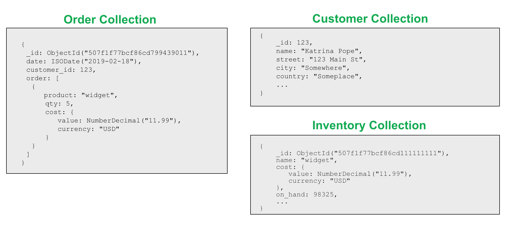

<!-- TABLE OF CONTENTS -->
# **Table of Contents**

- [**Table of Contents**](#table-of-contents)
- [**MongoDB and NoSQL database**](#mongodb-and-nosql-database)
  - [**What is NoSQL database?**](#what-is-nosql-database)
  - [**NoSQL vs SQL**](#nosql-vs-sql)
  - [**Schema**](#schema)
  - [**Schema in NoSQL**](#schema-in-nosql)
  - [**Indexing in MongoDB**](#indexing-in-mongodb)
    - [Single field index](#single-field-index)
    - [Compound index](#compound-index)
    - [Multikey indexes](#multikey-indexes)
    - [When should we create index?](#when-should-we-create-index)
  - [**MongoDB anti-pattern design**](#mongodb-anti-pattern-design)
    - [Massive arrays](#massive-arrays)
  - [**MongoDB pattern design**](#mongodb-pattern-design)
    - [The Extended Reference Pattern](#the-extended-reference-pattern)
    - [The Attribute Pattern](#the-attribute-pattern)
    - [The Outlier Pattern](#the-outlier-pattern)
    - [The Subset Pattern](#the-subset-pattern)
    - [The Polymorphic Pattern](#the-polymorphic-pattern)
    - [The Bucket Pattern](#the-bucket-pattern)
    - [The Computed Pattern](#the-computed-pattern)
  - [Aggregation](#aggregation)
    - [$lookup](#lookup)
- [**ORM and Driver**](#orm-and-driver)
- [**Mongoose**](#mongoose)
  - [**Basic commands**](#basic-commands)
    - [Create schema](#create-schema)
    - [Create model](#create-model)
    - [Create data instance](#create-data-instance)
    - [Save instance to collection](#save-instance-to-collection)
    - [Read](#read)
    - [Populate](#populate)
    - [Update](#update)
    - [Delete](#delete)
    - [Complex filter object](#complex-filter-object)
    - [Complex update object](#complex-update-object)
    - [Read Modifiers](#read-modifiers)
  - [**Schema types in mongoose**](#schema-types-in-mongoose)
    - [Embedded Schema](#embedded-schema)
    - [Reference Schema](#reference-schema)
  - [**Schema validation**](#schema-validation)

# **MongoDB and NoSQL database**

## **What is NoSQL database?**

NoSQL database like its name conveys, is `non-tabular database` in which they have no fixed schema. They may be `document`, `key-value`, `graph`, or `wide-column` stores.

## **NoSQL vs SQL**

Weak points over SQL (**${\color{lightblue}ACID}$** property):

- Atomic
- Consistency
- Isolation
- Durability

Strong points over SQL:

- Schema free
- Replication of data stores to avoid Single Point of Failure.
- Can handle Data variety and huge amounts of data.
- Scalability
- Can store unstructured, semi-structured data or structured data. While SQL is only for structured data.

**${\color{lightblue}BASE}$** property of NoSQL:

- Basically Available: Guarantees the availability of the data . There will be a response to any request (can be failure too).
- Soft state: The state of the system could change over time.
- Eventual consistency: The system will eventually become consistent once it stops receiving input.

## **Schema**

A database schema defines how data is `organized`, this is inclusive of logical constraints such as data types, and the `relationships between entities`.

Schemas commonly use visual representations to communicate the `architecture of the database`, becoming the foundation for an organization’s data management discipline. This process of database schema design is also known as `data modeling`.

## **Schema in NoSQL**

NoSQL doesn't have a fixed schema, but when working with NoSQL, there are some library that support createing Schema for your collection.

Aside from defining the structure of your documents and the types of data you're storing, a Schema handles the definition of:

- Validators (async and sync)
- Defaults
- Getters
- Setters
- Indexes
- Middleware
- Methods definition
- Statics definition
- Plugins
- pseudo-JOINs

// TODO: Schema handle getter, setter, index, middleware, ... ?

## **Indexing in MongoDB**

MongoDB prodives complete support for indexes on any field in a collection of documents. By default, all collections have an index on the `_id field` but user can create their own indexes.

### Single field index

To create an index on a field, we need to use createIndex() function.

```bash
  db.collection.createIndex({ score: 1 });
  # This will create ascending index one the field score
```

After creating the index, whenever the user's query can be optimized by using index, the database will use it. For example:

```shell
  db.collection.find().sort({ score: 1 });
  db.collection.updateMany({ score: 10 }, { score: 100 });
  # Instead of searching on the collections, which may be partitioned into blocks over the node network then searching
```

_${\color{yellow}{Note:}}$ Embedded field can also be created index on._

### Compound index

You can create compound index by adding more pairs on the parameter object.

For example :

```bash
  db.collection.createIndex({ "item": 1, "location": 1, "stock": 1 });
```

For a compound index, MongoDB can use the index to support queries on the index prefixes. As such, MongoDB can use the index for queries on the following fields:

- the ``item`` field,
- the ``item`` field and the ``location`` field,
- the ``item`` field and the ``location`` field and the ``stock`` field.

### Multikey indexes

To index a field that holds an array value, MongoDB creates an index key for each element in the array. These multikey indexes support efficient queries against array fields. Multikey indexes can be constructed over arrays that hold both scalar values (e.g. strings, numbers) and nested documents.

For a compound-multikey index, each indexed document can have at most one indexed field whose value is an array.

The following query looks for documents where the ratings field is the array [ 5, 9 ]:

```bash
  db.inventory.find( { ratings: [ 5, 9 ] } )
```

MongoDB can use the multikey index to find documents that have 5 at any position in the ratings array. Then, MongoDB retrieves these documents and filters for documents whose ratings array equals the query array [ 5, 9 ].

_${\color{yellow}{Note:}}$ $expr does not support multikey indexes._

// TODO: Text index, ... <https://www.mongodb.com/docs/manual/core/index-hashed/>

### When should we create index?

Indexing can help us reduce the query time in some function, however, it also costs to maintain the index in term of storage as well as execution factors. In short, the index itself need to justify its effiency over its maintain cost.

For example, when we update or insert an instance, we need to update the index also. Therefore, it's better to create index related to the query that user often use only.

## **MongoDB anti-pattern design**

### Massive arrays

``Data that is accessed together should be stored together`` -> developers sometimes take this too far and embed massive amounts of information in a single document.

How to fix ?

Instead of embedding many documents to one document, we could flip the model and instead embed that one document to many documents.

=> This might lead to duplication.

-> difficult to handle when we need to frequently update the object.If you need to update a lot, then you might opt for reference model.

-> However with reference model, you might find yourself need to use $lookup frequently, that will cause execution time.

-> [Extended reference pattern](#the-extended-reference-pattern)

## **MongoDB pattern design**

### The Extended Reference Pattern

The extend reference pattern is the most suitable for the case when we need to seperate related data into different collections but try to optimized the JOIN operation.

or example, in an e-commerce application, the idea of an order exists, as does a customer, and inventory. They are separate logical entities.



Embedding all of the information about a customer for each order just to reduce the JOIN operation results in a lot of duplicated information. Additionally, not all of the customer information may be needed for an order.

The Extended Reference pattern provides a great way to handle these situations. Instead of duplicating all of the information on the customer, we only copy the fields we access frequently. Instead of embedding all of the information or including a reference to JOIN the information, we only embed those fields of the highest priority and most frequently accessed, such as name and address.

[Reference here](https://www.mongodb.com/blog/post/building-with-patterns-the-extended-reference-pattern)

### The Attribute Pattern

### The Outlier Pattern

### The Subset Pattern

### The Polymorphic Pattern

### The Bucket Pattern

### The Computed Pattern

// TODO: <https://www.mongodb.com/blog/post/building-with-patterns-the-extended-reference-pattern>

## Aggregation

Aggregation operations process multiple documents and return computed results. You can use aggregation operations to:

- Group values from multiple documents together.

- Perform operations on the grouped data to return a single result.

- Analyze data changes over time.


### $lookup

- Equality Match with a Single Join Condition syntax :

```bash
{
  $lookup:
    {
      from: <>,
      localField: <>,
      foreignField: <field from the documents of the "from" collection>,
      as: <output array field>,
    }
}
```

- To perform correlated and uncorrelated subqueries with two collections, and perform other join conditions besides a single equality match, use this ``$lookup`` syntax:

```bash
{
  $lookup:
    {
      from: <joined collection>,
      let: { <var_1>: <expression>, …, <var_n>: <expression> },
      pipeline: [ <pipeline to run on joined collection> ],
      as: <output array field>
    }
}
```

Reference at : [mongodb.com-lookup](https://www.mongodb.com/docs/manual/reference/operator/aggregation/lookup/)

// TODO: Aggregation ($lookup, ...)

# **ORM and Driver**

`ORM` stands for `Object-Relational Mapping`, is a layer of software used to abstract away the work with database. Instead of working with raw data and raw query, user is now works with `object`, therefore user doesn't need to know how to work with the database driver to query them. When a query is executed, it will first be transform into raw queries first.

On the other hand, `database driver` require users to work directly with `raw queries`, and the users also need to handle much more low-level concept and works.

**When to use ORM and when not?**

As ORM simplifies the work with database, you should use it when the requirement for querying database is basic, where ORM does support it.

However in complicated project that requires high performance database queries, It is better to opt for working with driver (raw queries) instead.

# **Mongoose**

Mongoose is a MongoDB `object modeling tool` designed to work in an `asynchronous environment`. The part below will discuss how to use mongoose.

_**${\color{yellow}Note:}$** Mongoose supports both `promises` and `callbacks`._

## **Basic commands**

- Database connection command

In mongoose, we can use the below syntax to connect with the database:

```js
  mongoose.connect('mongodb://<HostIP>:<PORT>/<Database>');
```

The mongoose.connect is an async function and the time for connecting to mongodb server is quite large but mongoose has a `queue for storing database commands`, where all commands will be save there, waiting for the connection to establish and then run.

### Create schema

In mongoose, we can use the below syntax to create a new database schema:

```js
  new mongoose.Schema({
    attribute1: dataType1,
    attribute2: dataType2,
    ...
  });
```

We need a schema to create a model for ORM queries later.

### Create model

In mongoose, we can use the below syntax to create a new model:

```js
  mongoose.model('<collectionName>', schema);
```

The collectionName is the collection name of the collection in the database. The mongoose by default will auto `lowercase` the first character of the collectionName and convert it to `plural` state. If you didn't create a collection with that name before, mongoose will also create it for you.

The variable schema is the schema your created before.

For example:

```js
  collectionName: User  =>  users
```

### Create data instance

To create an instance, you can you the below method.

```js
  const newUser1 = new User({ 
    name: 'Duy Tan',
    age: 19,
  });

  const newUser2 = User.Create({
    name: 'Duy Tan',
    age: 19,
  })
```

The instance created is infact an object in JS, you can access and modify the data of it.

```js
  const userSchema = mongoose.Schema({
    name: 'Duy Tan',
    age: 19,
  });
  newUser.name = 'Truong Tran Duy Tan';
```

_${\color{yellow}Note :}$ Model.create() method accepts array of documents as the parameter and it will return an array of instance, however, you will need to save it one by one, and this will increase network delay time compare to insertMany(). **Both method are checked by the schema validation so when working with bulk create, use insertMany instead.**_

### Save instance to collection

After created new instance or update one, use can save them by the command ``document.save()`` to save it to the collection, or if you just update an array of documents, opt for ``documents.bulkSave()``:

_${\color{yellow}Note:}$ Don't use documents.bulkSave() for bulk-create this will cause error because bulkSave() use bulkWrite() under the hood and bulkWrite() doesn't support insertMany()._

```js
  newUser.save();
  updatedUsers.bulkSave();
```

### Read

Each object in MongoDB has an unique ID string, in mongoose you can search for an object by its ID or by search for it by its key-value pair. Or you can use findOne instead.

```js
  const users = await User.find({ name: 'Duy Tan' });
  // Return all the object in the collection that has the pair: name: 'Duy Tan';
  const address = await Address.findById("63686e68a496b9bddd3f225a");
  // Output: 
  //  {
  //    _id: new ObjectId("63686e68a496b9bddd3f225a"),
  //    city: 'Ho Chi Minh City',
  //    street: 'Phu Thuan',
  //    __v: 0 
  //  }
```

_${\color{yellow} Note:}$ There are functions that mongoose supports such as ``findOneAndUpdate()``, ``findByIdAndUpdate()``, `findOneAndReplace()` but they are recommended ``not to use`` because it will pass the validation step._

### Populate

In relational database, we have join method, but for non-relational database, we have a concept called populate, whenever in the schema of one collection we provide a reference (in any field) to a document from any other collection, we can call populate() method to fill the field with that document.

Let 's consider an example when you have 2 models Address and User where the User model has the field address that reference to an Address object.

``` js
  const addressSchema = new mongoose.Schema({
    city: String,
    street: String,
  });

  const userSchema = new mongoose.Schema({
    name: String,
    age: Number,
    address: {
      type: mongoose.Schema.Types.ObjectId,
      ref: 'Address',
    },
  });

  const Address = mongoose.model('Address', addressSchema);
  const User = mongoose.model('User', userSchema);

  User.find().populate('address');

  // This will return all users record with the address fields being filled.
  // address: {
  //   _id: new ObjectId("63686e68a496b9bddd3f225a"),
  //   city: 'Ho Chi Minh City',
  //   street: 'Phu Thuan',
  //   __v: 0
  // },

  // Instead of: 
  // address: new ObjectId("63686e68a496b9bddd3f225a"),
```

### Update

You can update documents in mongoose by call the function ``updateOne``, ``updateMany`` or ``replaceOne``.

- ``updateOne`` will update the first document that match the filter.
- ``updateMany`` will update all the documents that match the filter.
- ``replaceOne`` will replace the first document that match the filter by exactly the second parameter.

_${\color{yellow}{Note:}}$ Update and replace will bypass the validation step. They also don't change the object 's id._

```js
  User.updateMany({ age: 20 }, { $inc: { age: 1 } });
  // Increase all the user with the age of 20 by 1.
```

### Delete

You can update documents in mongoose by call the function ``deleteOne`` or ``deleteMany``.

- ``deleteOne`` will delete the first document that match the filter.
- ``deleteMany`` will delete all the documents that match the filter.

```js
  User.deleteMany({ age: 20 }, { $inc: { age: 1 } });
  // Increase all the user with the age of 20 by 1.
```

_${\color{yellow}{Note:}}$ If you delete a record that has another record points to, when populate that one, it will return **null** as the result._

### Complex filter object

- $eq: Check for equality
- $ne: Check for not equal

```js
  User.find({ name: { $eq: 'Duy Tan' } });
  User.find({ name: { $ne: 'Duy Tan' } });
```

- $gt / $gte: Check for greater than/ greater than or equal.
- $lt / $lte: Check for less than/ less than or equal.

```js
  User.find({ age: { $gt: 12 } })
  User.find({ age: { $gte: 15 } })
  User.find({ name: { $lt: 25 } });
  User.find({ name: { $lte: 24 } });
```

- $in: Check if the value is one of many values.
- $nin: Check if the value is none of many values.

```js
  User.find({ name: {
    $in: ['Duy Tan', 'Dai Ca Tan'],
  } });
  User.find({ name: {
    $nin: ['Duy Tan', 'Dai Ca Tan'],
  } });
```

- $and: Check if all of the mutiple conditions are true.
- $or: Check if one of mutiple conditions is true.
- $not: Negate the filter

```js
  User.find({ $and: [{ name: 'Duy Tan' }, { age: 19 }]});
  User.find({ $or: [{ name: 'Duy Tan' }, { age: 19 }]});
  User.find({ $not: { name: 'Duy Tan' } });
```

- $exist: Check if a field exist.

```js
  User.find({ name: { $exists: true } });
```

- $expr: Do comparisons between different fields.

```js
  User.find({ $expr: { $gt: [“$balance”, “$debt”] } });
```

### Complex update object

- $set: Update only the fields passed to $set. This will not affect
any fields not passed to $set.

```js
  User.updateOne({ age: 12 }, { $set: { name: “Hi” } });
  // Update the name of the first user with the age of 12 to the value Hi.
```

- $inc: Increment the value of the field by the amount given.

```js
  User.updateOne({ age: 12 }, { $inc: { age: 2 } });
  // Add 2 to the age of the first user with the age of 12.
```

- $rename: Rename a field.

```js
  User.updateMany({}, { $rename: { age: “years” } });
  // Rename the field age to years for all users
```

- $unset: Remove a field.

```js
  User.updateOne({ age: 12 }, { $unset: { age: “” } });
  // Remove the age field from the first user with an age of 12
```

- $push: Add a value to an array field.

```js
  User.updateMany({}, { $push: { friends: “John” } });
  // Add John to the friends array for all users
```

- $pull: Remove a value from an array field.
.

```js
  Users.updateMany({}, { $pull: { friends: “Mike” } });
  // Remove Mike from the friends array for all users
```

### Read Modifiers

- sort: Sort the results of a find by the given fields
- limit: Only return a set number of documents
- skip: Skip a set number of documents from the beginning

```js
  User.find().sort({ name: 1, age: -1 });
  // Get all users sorted by name in alphabetical order and then if any names are the same sort by age in reverse order.
  User.find().limit(2);
  // Only return the first 2 users.
  User.find().skip(4);
  // Skip the first 4 users when returning results. This is great for pagination when combined with limit.
```

## **Schema types in mongoose**

In MongoDB, we can have `reference` data model and `embedded` data model, the section below will discuss how to create one and when to use it.

### Embedded Schema

It is suggest that for `one-to-one relation` and `one-to-many relation`, when the data is often `used together`, we should opt for embedded model to include them inside one document as it still maintains the data consistency but also the query speed.

Take user-info and the user-account for example, Normally, when a user login, we will also need to get user-info later on, so in that case, we can merge the user-info collection and the user-account collection as one collection.

There are two ways to create embedded schema:

- Here is the syntax for the first way where you can define everything in one command:

```js
  const userSchema = new mongoose.Schema({
    userName: String,
    passWord: String,
    // Embedded here
    userInfo: {
      name: String,
      age: Number,
    }
  });
```

- Or you can create another schema and then link them together:

```js
  const userInfoSchema = new mongoose.Schema({
    name: String,
    age: Number,
  });

  const userInfoSchema = new mongoose.Schema({
    userName: String,
    passWord: String,
    // Embedded here
    userInfo: userInfoSchema,
  })
```

### Reference Schema

Reference model on the other hand is suitable for `many-to-many` relation or the case when the data is `too big to be stored inside one document` or the related data is `not often queried along`, it is better to use reference model.

Here is the syntax where you can define one in mongoose:

```js
  const userSchema = new mongoose.Schema({
    userName: String,
    passWord: String,
    // Reference here
    bestFriend: mongoose.Schema.ObjectId,
  })
```

## **Schema validation**

Mongoose supports addding constraint to the instance you created.

For example:

```js
  const userSchema = new mongoose.Schema({
    name: String,
    age: {
      type: Number,
      max: 100, // Upper-bound
      min: 1, // Lower-bound
      validate: {
        validator: v => v % 2,
        message: props => `${props.value} is not an event number`,
      },
    },
    email: {
      type: String,
      minLength: 10, // Lower-bound for length
      maxLength: 100, // Upper-bound for length
      required: true, // Not NULL constraint
      lowercase: true, // Auto lowercase convert
    },
    createAt: {
      type: Date,
      immutable: true,
      // User cannot change one assigned.
      default: () => Date.now(),
      // Give default value if user doesn't input.
    },
  });
```
