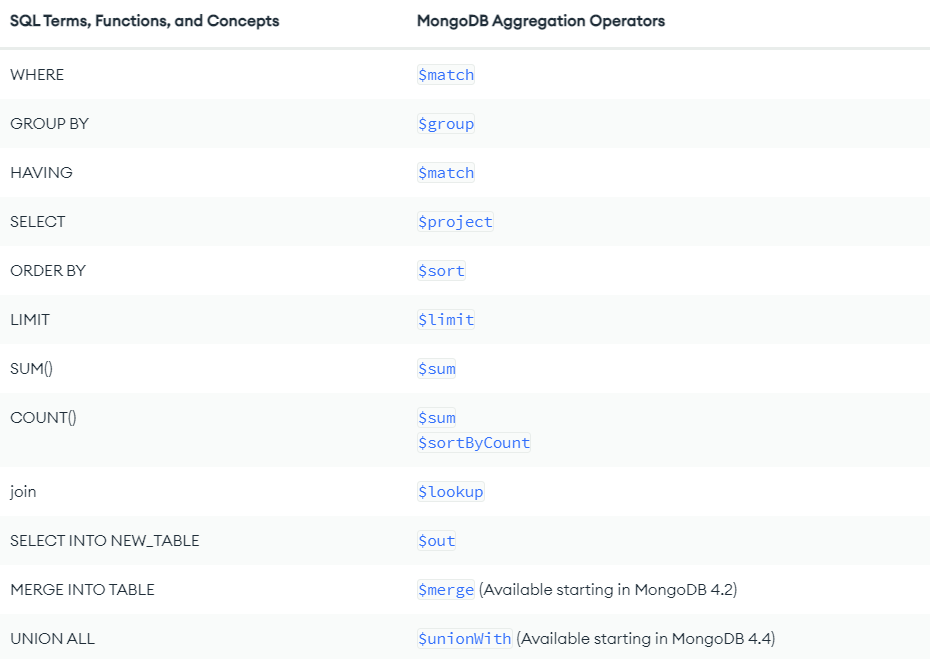

<!-- TABLE OF CONTENTS -->
# **Table of Contents**

- [**Table of Contents**](#table-of-contents)
- [**MongoDB and NoSQL database**](#mongodb-and-nosql-database)
  - [**What is NoSQL database?**](#what-is-nosql-database)
  - [**NoSQL vs SQL**](#nosql-vs-sql)
  - [**Schema**](#schema)
  - [**Schema in NoSQL**](#schema-in-nosql)
  - [**Indexing in MongoDB**](#indexing-in-mongodb)
    - [Single field index](#single-field-index)
    - [Compound index](#compound-index)
    - [Multikey indexes](#multikey-indexes)
    - [When should we create index?](#when-should-we-create-index)
  - [**MongoDB anti-pattern design**](#mongodb-anti-pattern-design)
    - [**Massive arrays**](#massive-arrays)
    - [**Massive number of collections**](#massive-number-of-collections)
    - [**Unnecessary indexes**](#unnecessary-indexes)
    - [**Bloated documents**](#bloated-documents)
    - [**Separating data that is accessed together**](#separating-data-that-is-accessed-together)
  - [**MongoDB pattern design**](#mongodb-pattern-design)
    - [The Extended Reference Pattern](#the-extended-reference-pattern)
    - [The Attribute Pattern](#the-attribute-pattern)
    - [The Bucket Pattern](#the-bucket-pattern)
    - [The Outlier Pattern](#the-outlier-pattern)
    - [The Subset Pattern](#the-subset-pattern)
    - [The Computed Pattern](#the-computed-pattern)
  - [Aggregation](#aggregation)
    - [Aggregation pipeline stage](#aggregation-pipeline-stage)
    - [Aggregation Pipeline Operators](#aggregation-pipeline-operators)
- [**ORM and Driver**](#orm-and-driver)
- [**Mongoose**](#mongoose)
  - [**Basic commands**](#basic-commands)
    - [Populate](#populate)
    - [Update](#update)
    - [Complex filter object](#complex-filter-object)
    - [Complex update object](#complex-update-object)
    - [Read Modifiers](#read-modifiers)
  - [**Schema types in mongoose**](#schema-types-in-mongoose)
    - [Embedded Schema](#embedded-schema)
    - [Reference Schema](#reference-schema)
    - [**Schema validation**](#schema-validation)
    - [**Default**](#default)
    - [**Function**](#function)
    - [**Lean method**](#lean-method)

# **MongoDB and NoSQL database**

## **What is NoSQL database?**

NoSQL database like its name conveys, is `non-tabular database` in which they have no fixed schema. They may be `document`, `key-value`, `graph`, or `wide-column` stores.

## **NoSQL vs SQL**

Weak points over SQL (**${\color{lightblue}ACID}$** property):

- Atomic
- Consistency
- Isolation
- Durability

Strong points over SQL:

- Schema free
- Replication of data stores to avoid Single Point of Failure.
- Can handle Data variety and huge amounts of data.
- Scalability
- Can store unstructured, semi-structured data or structured data. While SQL is only for structured data.

**${\color{lightblue}BASE}$** property of NoSQL:

- Basically Available: Guarantees the availability of the data . There will be a response to any request (can be failure too).
- Soft state: The state of the system could change over time.
- Eventual consistency: The system will eventually become consistent once it stops receiving input.

## **Schema**

A database schema defines how data is `organized`, this is inclusive of logical constraints such as data types, and the `relationships between entities`.

Schemas commonly use visual representations to communicate the `architecture of the database`, becoming the foundation for an organization’s data management discipline. This process of database schema design is also known as `data modeling`.

## **Schema in NoSQL**

NoSQL doesn't have a fixed schema, but when working with NoSQL, there are some library that support createing Schema for your collection.

Aside from defining the structure of your documents and the types of data you're storing, a Schema handles the definition of:

- Validators
- Defaults
- Middleware
- Methods, Statics definition

## **Indexing in MongoDB**

MongoDB prodives complete support for indexes on any field in a collection of documents. By default, all collections have an index on the `_id field` but user can create their own indexes.

### Single field index

To create an index on a field, we need to use createIndex() function.

```bash
  db.collection.createIndex({ score: 1 });
  # This will create ascending index one the field score
```

_${\color{yellow}{Note:}}$ Embedded field can also be created index on._

### Compound index

You can create compound index by adding more pairs on the parameter object.

For example :

```bash
  db.collection.createIndex({ "item": 1, "location": 1, "stock": 1 });
```

For a compound index, MongoDB can use the index to support queries on the index prefixes. As such, MongoDB can use the index for queries on the following fields:

- the ``item`` field,
- the ``item`` field and the ``location`` field,
- the ``item`` field and the ``location`` field and the ``stock`` field.

### Multikey indexes

To index a field that holds an array value, MongoDB creates an index key for each element in the array. These multikey indexes support efficient queries against array fields. Multikey indexes can be constructed over arrays that hold both scalar values (e.g. strings, numbers) and nested documents.

For a compound-multikey index, each indexed document can have at most one indexed field whose value is an array.

The following query looks for documents where the ratings field is the array [ 5, 9 ]:

```bash
  db.inventory.find( { ratings: [ 5, 9 ] } )
```

MongoDB can use the multikey index to find documents that have 5 at any position in the ratings array. Then, MongoDB retrieves these documents and filters for documents whose ratings array equals the query array [ 5, 9 ].

_${\color{yellow}{Note:}}$ $expr does not support multikey indexes._

### When should we create index?

Indexing can help us reduce the query time in some function, however, it also costs to maintain the index in term of storage as well as execution factors. In short, the index itself need to justify its effiency over its maintain cost.

For example, when we update or insert an instance, we need to update the index also. Therefore, it's better to create index related to the query that user often use only.

## **MongoDB anti-pattern design**

### **Massive arrays**

``Data that is accessed together should be stored together``

-> developers sometimes take this too far and embed massive amounts of information in a single document.

- How to fix?

Instead of embedding many documents to one document, we could flip the model and instead embed that one document to many documents.

=> This might lead to duplication, difficult to handle when we need to frequently update the object.

If you need to update a lot, then you might opt for reference model. However with reference model, you might find yourself need to use $lookup frequently, that will cause execution time.

Then we have the [Extended reference pattern](#the-extended-reference-pattern) designed to solve the problem.

### **Massive number of collections**

Storing a massive number of collections (especially if they are unused or unnecessary) in your database.

Every collection in MongoDB automatically has an index on the _id field. While the size of this index is pretty small for empty or small collections, thousands of empty or unused indexes can begin to drain resources. Collections will typically have a few more indexes to support efficient queries. All of these indexes add up.

Additionally, the WiredTiger storage engine (MongoDB's default storage engine) stores a file for each collection and a file for each index. WiredTiger will open all files upon startup, so performance will decrease when an excessive number of collections and indexes exist.

In general, we recommend limiting collections to 10,000 per replica set. When users begin exceeding 10,000 collections, they typically see decreases in performance.

To avoid this anti-pattern, examine your database and remove unnecessary collections. If you find that you have an increasing number of collections, consider remodeling your data so you have a consistent set of collections.

### **Unnecessary indexes**

Storing an index that is unnecessary because it is:

- rarely used if at all .
- redundant because another compound index covers it.

Reason why we shouldn't create indexes for every fields:

- Indexes take up space.
- Indexes can impact the storage engine's performance.
- Indexes can impact write performance.

### **Bloated documents**

Storing large amounts of data together in a document when that data is not frequently accessed together.

To keep your queries running as quickly as possible, WiredTiger(the default storage engine for MongoDB) keeps all of the indexes plus the documents that are accessed the most frequently in memory. When these frequently accessed documents and index pages fit in the RAM allotment, MongoDB can query from memory instead of from disk. Queries from memory are faster, so the goal is to keep your most popular documents small enough to fit in the RAM allotment.
The working set's RAM allotment is the larger of:

- 50% of (RAM - 1 GB)
- 256 MB.

Sometimes data that is related to each other isn't actually accessed together. You might have large, bloated documents that contain information that is related but not actually accessed together frequently. In that case, separate the information into smaller documents in separate collections and use references to connect those documents together.

### **Separating data that is accessed together**

Separating data between different documents and collections that is frequently accessed together.

MongoDB has a ``$lookup`` operation that allows you to join information from more than one collection. ``$lookup`` is great for infrequent, rarely used operations or analytical queries that can run overnight without a time limit. However, ``$lookup`` is not so great when you're frequently using it in your applications as ``$lookup`` operations are ``slow`` and ``resource-intensive`` compared to operations that don't need to combine data from more than one collection.

``Data that is accessed together should be stored together.`` If you'll be frequently reading or updating information together, consider storing the information together using nested documents or arrays. Carefully consider your use case and weigh the benefits and drawbacks of data duplication as you bring data together.

## **MongoDB pattern design**

### The Extended Reference Pattern

The extend reference pattern is the most suitable for the case when we need to seperate related data into different collections but try to optimized the JOIN operation.

or example, in an e-commerce application, the idea of an order exists, as does a customer, and inventory. They are separate logical entities.


Embedding all of the information about a customer for each order just to reduce the JOIN operation results in a lot of duplicated information. Additionally, not all of the customer information may be needed for an order.

The Extended Reference pattern provides a great way to handle these situations. Instead of duplicating all of the information on the customer, we only copy the fields we access frequently. Instead of embedding all of the information or including a reference to JOIN the information, we only embed those fields of the highest priority and most frequently accessed, such as name and address.

[Reference here](https://www.mongodb.com/blog/post/building-with-patterns-the-extended-reference-pattern)

### The Attribute Pattern

The Attribute Pattern is particularly well suited when:

- We have big documents with many similar fields but there is a subset of fields that share common characteristics and we want to sort or query on that subset of fields.
- The fields we need to sort on are only found in a small subset of documents.
- Both of the above conditions are met within the documents.

For performance reasons, to optimize our search we'd likely need many indexes to account for all of the subsets. Creating all of these indexes could reduce performance. The Attribute Pattern provides a good solution for these cases.

Fix: Moving this subset of data into a key-value sub-document

The Attribute Pattern provides for easier indexing the documents, targeting many similar fields per document. By moving this subset of data into a key-value sub-document, we can use non-deterministic field names, add additional qualifiers to the information, and more clearly state the relationship of the original field and value. When we use the Attribute Pattern, we need fewer indexes, our queries become simpler to write, and our queries become faster.

### The Bucket Pattern

This pattern is particularly effective when working with Internet of Things (IoT), Real-Time Analytics, or Time-Series data in general. By bucketing data together we make it easier to organize specific groups of data, increasing the ability to discover historical trends or provide future forecasting and optimize our use of storage.

With data coming in as a stream over a period of time (time series data) we may be inclined to store each measurement in its own document. However, this inclination is a very relational approach to handling the data. This can pose some issues as our application scales in terms of data and index size.

By applying the Bucket Pattern to our data model, we get some benefits in terms of index size savings, potential query simplification, and the ability to use that pre-aggregated data in our documents.

### The Outlier Pattern

What happens, when the document structure isn't consistent? What happens when there is data that falls outside the "normal" pattern? What if there's an outlier? Or in other word, we try to handle the "overflow" case.

Fix: Add one field to indicate that there is extra information related to the object written in other documents.

With the Outlier Pattern, we are working to prevent a few queries or documents driving our solution towards one that would not be optimal for the majority of our use cases.

### The Subset Pattern

This pattern addresses the issues associated with a working set that exceeds RAM, resulting in information being removed from memory. This is frequently caused by large documents which have a lot of data that isn't actually used by the application.

Imagine an e-commerce site that has a list of reviews for a product. When accessing that product's data it's quite possible that we'd only need the most recent ten or so reviews. Pulling in the entirety of the product data with all of the reviews could easily cause the working set to expand.

Instead of storing all the reviews with the product, we can split the collection into two collections. One collection would have the most frequently used data, e.g. current reviews and the other collection would have less frequently used data, e.g. old reviews, product history, etc. We can duplicate part of a 1-N or N-N relationship that is used by the most used side of the relationship.

By using smaller documents with more frequently accessed data, we reduce the overall size of the working set. This allows for shorter disk access times for the most frequently used information that an application needs. One tradeoff that we must make when using the Subset Pattern is that we must manage the subset and also if we need to pull in older reviews or all of the information, it will require additional trips to the database to do so.

### The Computed Pattern

The Computed Pattern is utilized when we have data that needs to be computed repeatedly in our application. The Computed Pattern is also utilized when the data access pattern is read intensive; for example, if you have 1,000,000 reads per hour but only 1,000 writes per hour, doing the computation at the time of a write would divide the number of calculations by a factor 1000.

This powerful design pattern allows for a reduction in CPU workload and increased application performance. It can be utilized to apply a computation or operation on data in a collection and store the result in a document. This allows for the avoidance of the same computation being done repeatedly. Whenever your system is performing the same calculations repeatedly and you have a high read to write ratio, consider the Computed Pattern.

## Aggregation

Aggregation operations process multiple documents and return computed results. You can use aggregation operations to:

- Group values from multiple documents together.

- Perform operations on the grouped data to return a single result.

- Analyze data changes over time.



### Aggregation pipeline stage

- $lookup

Equality Match with a Single Join Condition syntax :

```bash
{
  $lookup:
    {
      from: <>,
      localField: <>,
      foreignField: <field from the documents of the "from" collection>,
      as: <output array field>,
    }
}
```

To perform correlated and uncorrelated subqueries with two collections, and perform other join conditions besides a single equality match, use this ``$lookup`` syntax:

```bash
{
  $lookup:
    {
      from: <joined collection>,
      let: { <var_1>: <expression>, …, <var_n>: <expression> },
      pipeline: [ <pipeline to run on joined collection> ],
      as: <output array field>
    }
}
```

- $project

Passes along the documents with the requested fields to the next stage in the pipeline. The specified fields can be existing fields from the input documents or newly computed fields.

The ``$project`` stage has the following prototype form:

```bash
  { $project: { <specification(s)> } }
```

${\color{yellow}{Note:}}$ _The specification ``\<field>: \<expression>`` will add a new field or resets the value of an existing field._

```bash
  { $project: { "<field1>": 0, "<field2>": 0, ... } } 
  # Return all but the specified fields
```

- $sort

Sorts all input documents and returns them to the pipeline in sorted order.

The ``$sort`` stage has the following prototype form:

```bash
  { $sort: { <field1>: <sort order>, <field2>: <sort order> ... } }
```

**Example:** Consider the following restaurant collection:

```bash
  db.restaurants.insertMany( [
    { "_id" : 1, "name" : "Central Park Cafe", "borough" : "Manhattan"},
    { "_id" : 2, "name" : "Rock A Feller Bar and Grill", "borough" : "Queens"},
    { "_id" : 3, "name" : "Empire State Pub", "borough" : "Brooklyn"},
    { "_id" : 4, "name" : "Stan's Pizzaria", "borough" : "Manhattan"},
    { "_id" : 5, "name" : "Jane's Deli", "borough" : "Brooklyn"},
  ] );
```

The following command uses the ``$sort`` stage to sort on the borough field:

```bash
  db.restaurants.aggregate(
    [
      { $sort : { borough : 1 } }
    ]
  )
```

- $group >< $unwind

The ``$group`` stage separates documents into groups according to a "group key". The output is one document for each unique group key.

A group key is often a field, or group of fields. The group key can also be the result of an expression. Use the _id field in the $group pipeline stage to set the group key.

The ``$group`` stage has the following prototype form:

```bash
  {
    $group:
      {
        _id: <expression>, // Group key
        <field1>: { <accumulator1> : <expression1> },
        ...
      }
  }
```

``$unwind`` Deconstructs an array field from the input documents to output a document for each element. Each output document is the input document with the value of the array field replaced by the element.

You can pass a document to ``$unwind`` to specify various behavior options.

```bash
{
  $unwind:
    {
      path: <field path>,
      includeArrayIndex: <string>,
      preserveNullAndEmptyArrays: <boolean>
    }
}
```

- $count

Passes a document to the next stage that contains a count of the number of documents input to the stage.

``$count`` has the following prototype form:

```bash
  { $count: <string> }
```

- $merge

Writes the results of the aggregation pipeline to a specified collection. The $merge operator must be the last stage in the pipeline.

$merge
 has the following syntax:

```bash
{ $merge: {
     into: <collection> -or- { db: <db>, coll: <collection> },
     on: <identifier field> -or- [ <identifier field1>, ...],  
     # Optional
     let: <variables>,                                         
     # Optional
     whenMatched: <replace|keepExisting|merge|fail|pipeline>,  
     # Optional
     whenNotMatched: <insert|discard|fail>                     
     # Optional
} }
```

- $limit

Limits the number of documents passed to the next stage in the pipeline.

The ``$limit`` stage has the following prototype form:

```bash
  { $limit: <positive 64-bit integer> }
```

### Aggregation Pipeline Operators

- $arrayElemAt(aggregation)

Returns the element at the specified array index.

$arrayElemAt has the following syntax:

```bash
{ $arrayElemAt: [ <array>, <idx> ] }
```

**Example:**

A collection named users contains the following documents:

```js
{ "_id" : 1, "name" : "dave123", favorites: [ "chocolate", "cake", "butter", "apples" ] }
{ "_id" : 2, "name" : "li", favorites: [ "apples", "pudding", "pie" ] }
{ "_id" : 3, "name" : "ahn", favorites: [ "pears", "pecans", "chocolate", "cherries" ] }
{ "_id" : 4, "name" : "ty", favorites: [ "ice cream" ] }

```

The following example returns the first and last element in the favorites array:

```bash
  db.users.aggregate([
    {
      $project:
        {
          name: 1,
          first: { $arrayElemAt: [ "$favorites", 0 ] },
          last: { $arrayElemAt: [ "$favorites", -1 ] }
        }
    }
  ])
```

- $reduce(aggregation)

Applies an expression to each element in an array and combines them into a single value.

``$reduce`` has the following syntax:

```bash
{
  $reduce: {
    input: <array>,
    initialValue: <expression>,
    in: <expression>
  }
}
```

- $let(aggregation)

Binds variables for use in the specified expression, and returns the result of the expression.

The ``$let`` expression has the following syntax:

```bash
{
  $let:
     {
       vars: { <var1>: <expression>, ... },
       in: <expression>
     }
}
```

**Example**: A sales collection has the following documents:

```bash
  { _id: 1, price: 10, tax: 0.50, applyDiscount: true }
  { _id: 2, price: 10, tax: 0.25, applyDiscount: false }
```

The following aggregation uses ``$let`` in the $project pipeline stage to calculate and return the finalTotal for each document:

```bash
db.sales.aggregate( [
   {
      $project: {
         finalTotal: {
            $let: {
               vars: {
                  total: { $add: [ '$price', '$tax' ] },
                  discounted: { $cond: { if: '$applyDiscount', then: 0.9, else: 1 } }
               },
               in: { $multiply: [ "$$total", "$$discounted" ] }
            }
         }
      }
   }
] )
```

The aggregation returns the following results:

```bash
{ "_id" : 1, "finalTotal" : 9.450000000000001 }
{ "_id" : 2, "finalTotal" : 10.25 }
```

# **ORM and Driver**

`ORM` stands for `Object-Relational Mapping`, is a layer of software used to abstract away the work with database. Instead of working with raw data and raw query, user is now works with `object`, therefore user doesn't need to know how to work with the database driver to query them. When a query is executed, it will first be transform into raw queries first.

On the other hand, `database driver` require users to work directly with `raw queries`, and the users also need to handle much more low-level concept and works.

**When to use ORM and when not?**

As ORM simplifies the work with database, you should use it when the requirement for querying database is basic, where ORM does support it.

However in complicated project that requires high performance database queries, It is better to opt for working with driver (raw queries) instead.

# **Mongoose**

Mongoose is a MongoDB `object modeling tool` designed to work in an `asynchronous environment`. The part below will discuss how to use mongoose.

_**${\color{yellow}Note:}$** Mongoose supports both `promises` and `callbacks`._

## **Basic commands**

### Populate

In relational database, we have join method, but for non-relational database, we have a concept called populate, whenever in the schema of one collection we provide a reference (in any field) to a document from any other collection, we can call populate() method to fill the field with that document.

Let 's consider an example when you have 2 models Address and User where the User model has the field address that reference to an Address object.

``` js
  const userSchema = new mongoose.Schema({
    name: String,
    age: Number,
    address: {
      type: mongoose.Schema.Types.ObjectId,
      ref: 'Address',
    },
  }); 
  // User object refers to another address object
  User.find().populate('address');
```

### Update

You can update documents in mongoose by call the function ``updateOne``, ``updateMany`` or ``replaceOne``.

- ``updateOne`` will update the first document that match the filter.
- ``updateMany`` will update all the documents that match the filter.
- ``replaceOne`` will replace the first document that match the filter by exactly the second parameter.

_${\color{yellow}{Note:}}$ Update and replace will bypass the validation step. They also don't change the object 's id._

```js
  User.updateMany({ age: 20 }, { $inc: { age: 1 } });
  // Increase all the user with the age of 20 by 1.
```

### Complex filter object

- $eq: Check for equality
- $ne: Check for not equal
- $gt / $gte: Check for greater than/ greater than or equal.
- $lt / $lte: Check for less than/ less than or equal.
- $in: Check if the value is one of many values.
- $nin: Check if the value is none of many values.
- $and: Check if all of the mutiple conditions are true.
- $or: Check if one of mutiple conditions is true.
- $not: Negate the filter
- $exist: Check if a field exist.
- $expr: Do comparisons between different fields.

### Complex update object

- $set: Update only the fields passed to $set. This will not affect any fields not passed to $set.
- $inc: Increment the value of the field by the amount given.
- $rename: Rename a field.
- $unset: Remove a field.
- $push: Add a value to an array field.
- $pull: Remove a value from an array field.

### Read Modifiers

- sort: Sort the results of a find by the given fields
- limit: Only return a set number of documents
- skip: Skip a set number of documents from the beginning

## **Schema types in mongoose**

In MongoDB, we can have `reference` data model and `embedded` data model, the section below will discuss how to create one and when to use it.

### Embedded Schema

It is suggest that for `one-to-one relation` and `one-to-many relation`, when the data is often `used together`, we should opt for embedded model to include them inside one document as it still maintains the data consistency but also the query speed.

Take user-info and the user-account for example, Normally, when a user login, we will also need to get user-info later on, so in that case, we can merge the user-info collection and the user-account collection as one collection.

### Reference Schema

Reference model on the other hand is suitable for `many-to-many` relation or the case when the data is `too big to be stored inside one document` or the related data is `not often queried along`, it is better to use reference model.

### **Schema validation**

Mongoose supports addding constraint to the instance you created.

For example:

```js
  const userSchema = new mongoose.Schema({
    name: String,
    age: {
      type: Number,
      max: 100,   // Upper-bound
      min: 1,     // Lower-bound
      immutable: true,  // User cannot change one assigned.
      required: true,   // Not NULL constraint
      validate: {
        validator: v => v % 2,
        message: props => `${props.value} is not an event number`,
      },
    },
  });
```

### **Default**

Mongoose supports default value if you don't assign it.

For example:

```js
  const userSchema = new mongoose.Schema({
    name: String,
    createAt: {
      type: Date,
      default: () => Date.now(),
      // Give default value if user doesn't input.
    },
  });
```

### **Function**

Mongoose supports addding function to the schema.

For example:

```js
  userSchema.methods.sayHi = function() {
    console.log(`Hi. My name is ${this.name}`)
  }
```

_${\color{yellow}{Note:}}$ Don't use arrow function because we need the this property to reference invidual instances 's property._

To create function for the model itself (not for the instance) use the static key word.

```js
  userSchema.statics.findByName = function(name){
    return this.where({ name: new RegExp(name, 'i')})
  }
```

### **Lean method**

By default, Mongoose queries return an instance of the Mongoose Document class. Documents are much heavier than vanilla JavaScript objects, because they have a lot of internal state for change tracking. Enabling the ``lean`` option tells Mongoose to skip instantiating a full Mongoose document and just give you the POJO.

Example

  ```js
    const leanDoc = await MyModel.findOne().lean();
  ```

_${\color{yellow}{Note:}}$ Mongoose support using ``populate()`` with ``lean()`` option._
